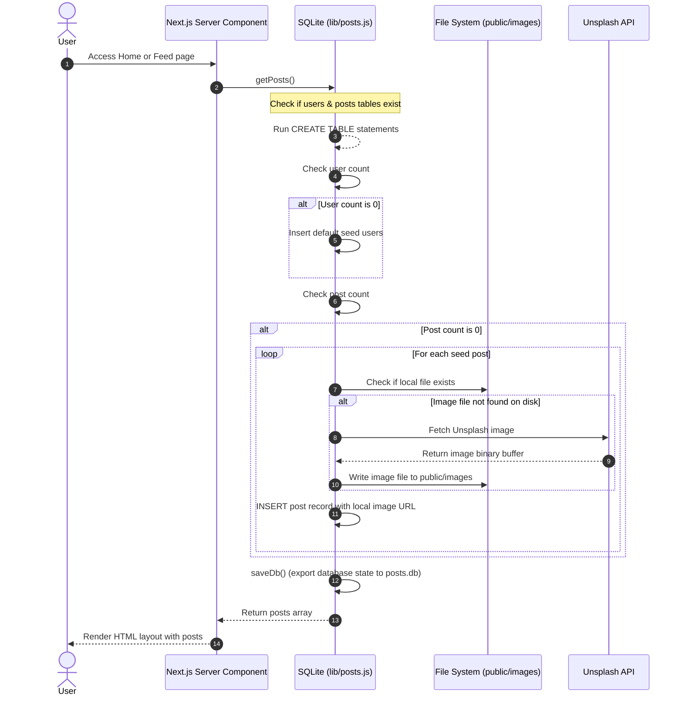
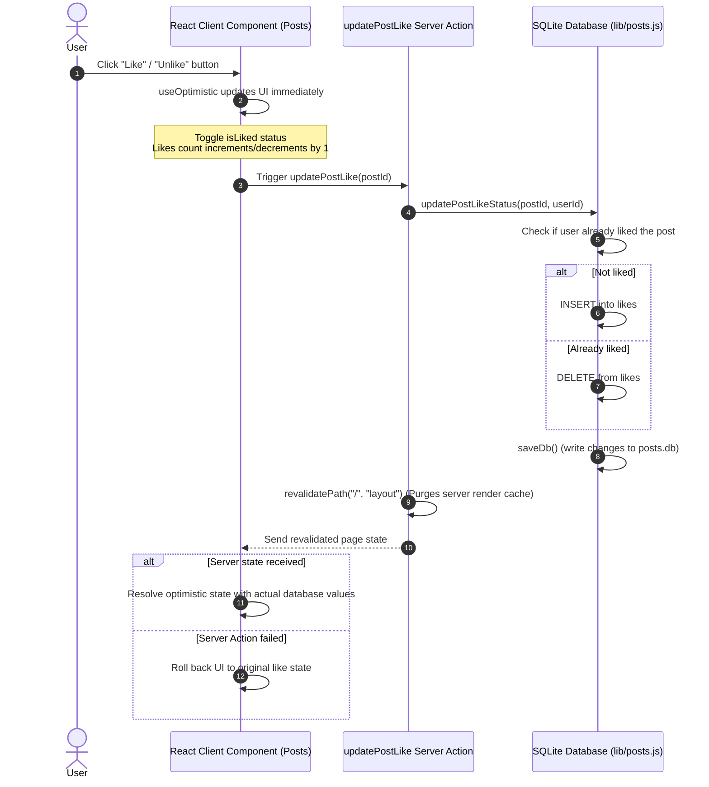
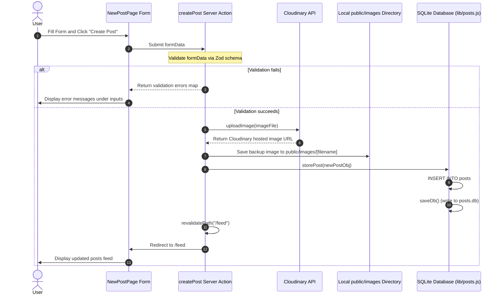

# Program Flow - NextPosts

This document outlines the operational flow of key operations in **NextPosts**, illustrating the communication between the client, server, and SQLite database.

---

## 1. Initial Load & Database Seeding Flow

When the NextPosts application boots up or handles its first request, the database automatically seeds itself if no data is present.

---

## 2. Like Status Update Flow (Optimistic UI)

Liking or unliking a post happens instantly on the UI first, and then synchronizes in the background with the database.

---

## 3. Creating a New Post Flow

This flow illustrates form validation, image uploading to Cloudinary, and database storage.

