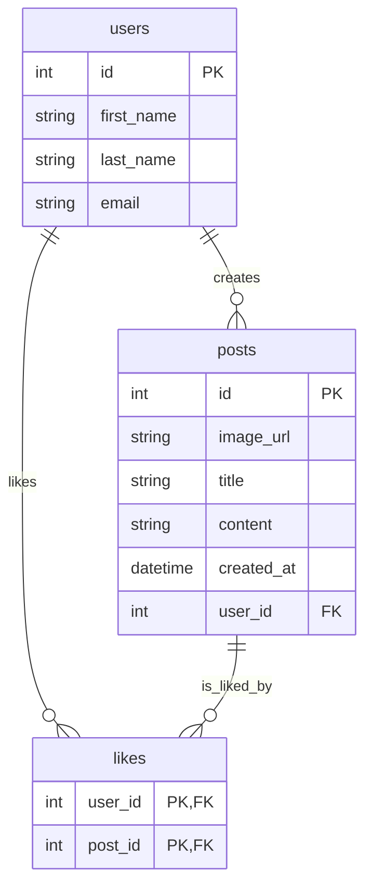
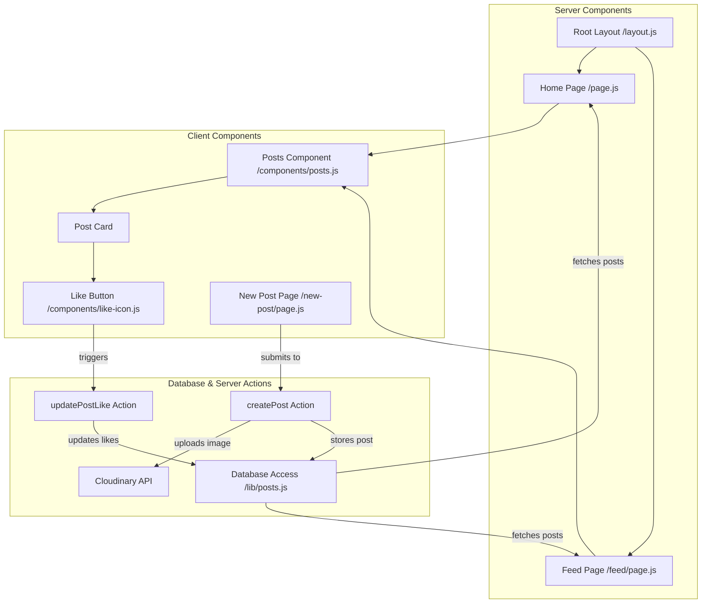

# UML Diagrams - NextPosts

This document contains the UML architecture diagrams of the **NextPosts** content-sharing platform, representing both the database structure and the system component relationships.

---

## 1. Database Entity-Relationship Diagram (ERD)

The database consists of three entities: `users`, `posts`, and `likes`. The relationship between `users` and `posts` is 1-to-many. The relationship between `users` and `posts` via `likes` is many-to-many.

---

## 2. Component Relationship Diagram

NextPosts utilizes Next.js App Router architecture. Below is the relationship between Server Components, Client Components, Actions, and Database modules.

